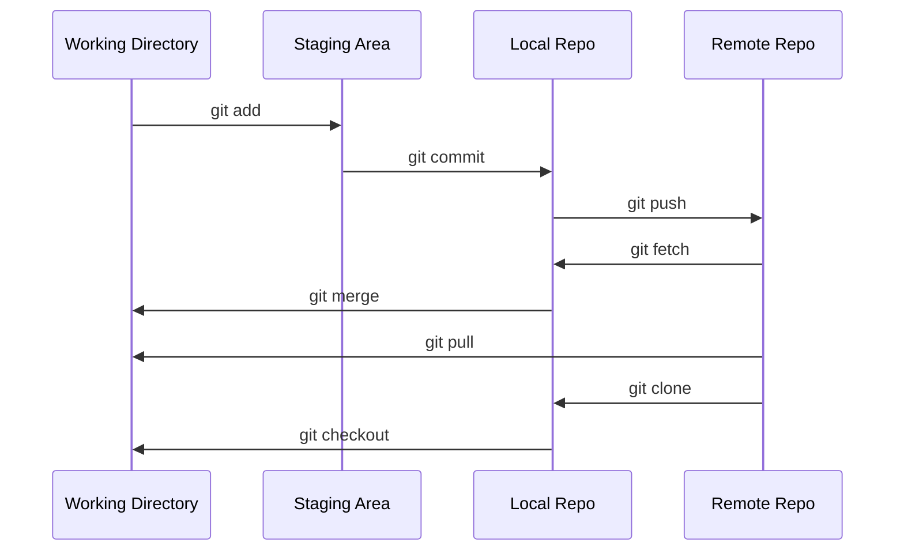

```mermaid
sequenceDiagram
    participant Working Directory
    participant Staging Area
    participant Local Repo
    participant Remote Repo
    Working Directory->>Staging Area:git add
    Staging Area->>Local Repo:git commit
    Local Repo->>Remote Repo:git push
    Remote Repo->>Local Repo:git fetch
    Local Repo->>Working Directory:git merge
    Remote Repo->>Working Directory:git pull
    Remote Repo->>Local Repo:git clone
    Local Repo->>Working Directory:git checkout
```
